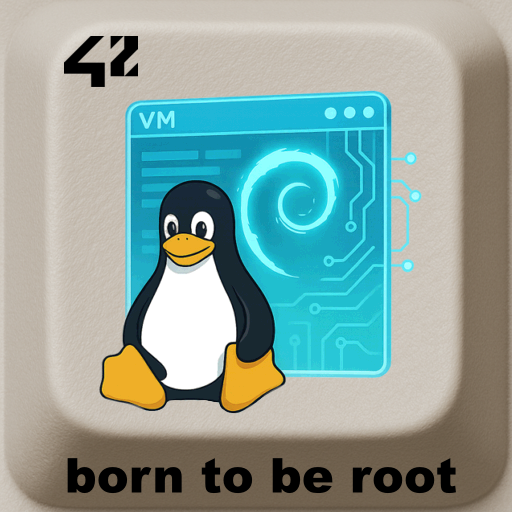

<div align="center">
  <h1>Born2beroot – Virtual Machine & Security</h1>
  
  <br>
</div>


> **Born2beroot** is a system administration project.  
> The goal is to configure a **Debian-based virtual machine** with strict security rules and monitoring.

---

## 📖 Table of Contents
- [Description](#-description)
- [Features](#-features)
- [Installation](#%EF%B8%8F-installation)
- [Usage](#-usage)
- [Project Structure](#-project-structure)
- [Examples](#-examples)
- [Roadmap](#-roadmap)
- [Credits](#-credits)
- [License](#-license)

---

## 📝 Description
This project teaches:  
- System installation (Debian or Rocky Linux).  
- Partitioning with **LVM**.  
- User and group management.  
- Configuring **SSH**, and **UFW**.  
- Creating a monitoring script for system health.  

---

## ✨ Features
- ✅ Secure Debian installation.  
- ✅ Enforced password policy.  
- ✅ Sudo configuration with logs.  
- ✅ Firewall with **UFW**.  
- ✅ Intrusion prevention.  
- ✅ Cron-based monitoring script.  

---

## ⚙️ Installation
Nothing to install – the virtual machine is not shared here.

---

## 🖥 Usage

In this repository you will find:
- various configuration files used by the needed tools,
- the monitoring script,
- a memo file containing most of the commands needed to configure the machine.

---

## 📂 Project Structure

```
.
├── img/            			# Content for README
├── config_files/   			# Configutation files
├── scripts/   					# Script files
├── commandes.txt   			# memo of configuration commands
├── fr.subjectborn2beroot.pdf	# Subject file
├── LICENSE						# License MIT
└── README.md
```

---

## 🔎 Examples

```bash
$ cat Born_to_be_root/config_files/common-password
#
# /etc/pam.d/common-password - password-related modules common to all services
#
# This file is included from other service-specific PAM config files,
# and should contain a list of modules that define the services to be
# used to change user passwords.  The default is pam_unix.

# Explanation of pam_unix options:
# The "yescrypt" option enables
#hashed passwords using the yescrypt algorithm, introduced in Debian
#11.  Without this option, the default is Unix crypt.  Prior releases
#used the option "sha512"; if a shadow password hash will be shared
#between Debian 11 and older releases replace "yescrypt" with "sha512"
#for compatibility .  The "obscure" option replaces the old
#`OBSCURE_CHECKS_ENAB' option in login.defs.  See the pam_unix manpage
#for other options.

# As of pam 1.0.1-6, this file is managed by pam-auth-update by default.
# To take advantage of this, it is recommended that you configure any
# local modules either before or after the default block, and use
# pam-auth-update to manage selection of other modules.  See
# pam-auth-update(8) for details.

# here are the per-package modules (the "Primary" block)
password	requisite			pam_pwquality.so retry=3
password	[success=1 default=ignore]	pam_unix.so obscure use_authtok try_first_pass yescrypt
# here's the fallback if no module succeeds
password	requisite			pam_deny.so
# prime the stack with a positive return value if there isn't one already;
# this avoids us returning an error just because nothing sets a success code
# since the modules above will each just jump around
password	required			pam_permit.so
# and here are more per-package modules (the "Additional" block)
# end of pam-auth-update config
```

---

## 🚀 Roadmap
This project is the original version that was evaluated at 42 and will remain in this state.

---

## 👤 Credits
Project developed by **Loïc Gérard** – 📧 Contact: lgerard@studend.42perpignan.fr - [École 42 Perpignan](https://42perpignan.fr).

---

## 📜 License
This project is licensed under the MIT License. You are free to use, modify, and distribute it - see the [LICENSE](./LICENSE) file for details.

> ⚠️ **Note for students**  
> If you are a student at 42 (or elsewhere), it is strongly recommended **not to copy/paste** this code.  
> Instead, try to **write your own solution** — it’s the only way to really learn and succeed.